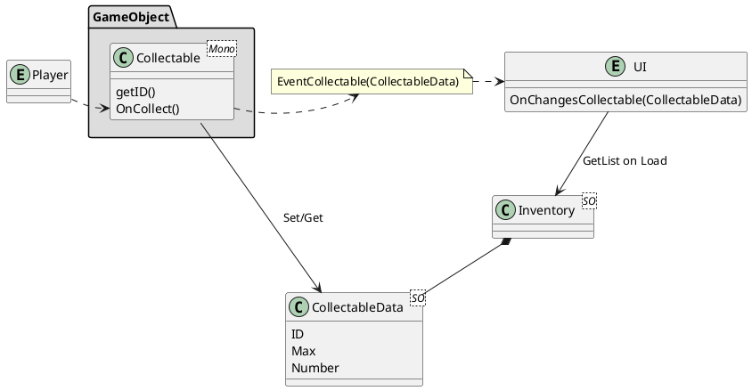

# Architecture Collectable System

```plantuml
@startuml

entity Player
entity UI
{
    OnChangesCollectable(CollectableData)
}

package GameObject  #DDDDDD {
class Collectable<Mono>
{
    getID()
    OnCollect()
}
}

class CollectableData<SO>
{
    ID
    Max
    Number
}

class Inventory<SO>


Inventory *-- CollectableData

CollectableData <-- Collectable : Set/Get
Player .> Collectable::OnCollect

note "EventCollectable(CollectableData)" as Event

Collectable::OnCollect .> Event
Event .> UI
UI --> Inventory : GetList on Load

@enduml
```