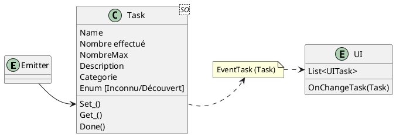

# Architecture Task System

```plantuml
@startuml

entity Emitter
entity UI
{
    List<UITask>
    OnChangeTask(Task)
}

note "EventTask (Task)" as Event

class Task<SO>
{
    Name
    Nombre effectué
    NombreMax
    Description
    Categorie
    Enum [Inconnu/Découvert]
    Set_()
    Get_()
    Done()
}
Emitter -> Task::Set

Task::Set .> Event 
Event .> UI

@enduml
```